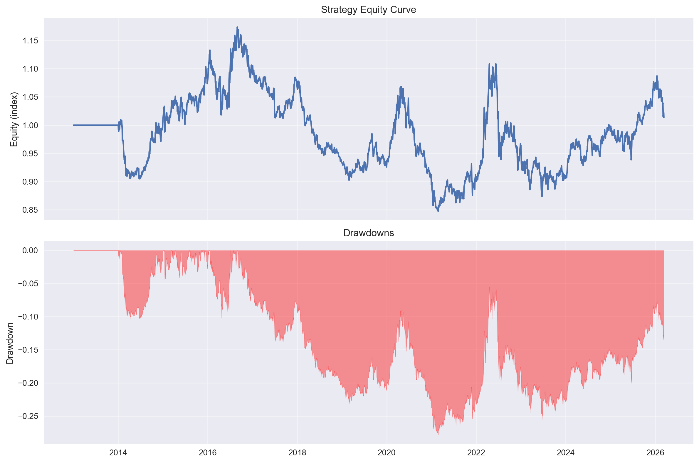
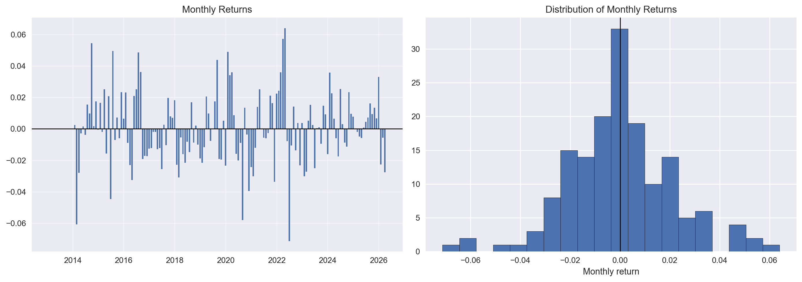
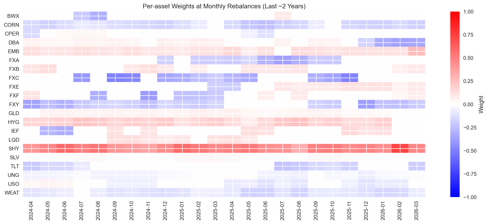
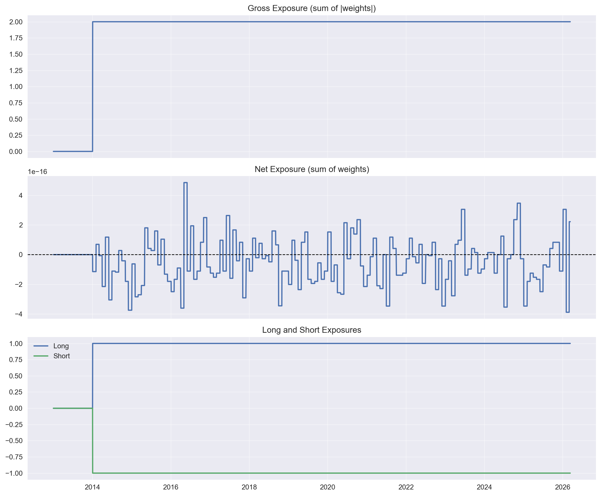
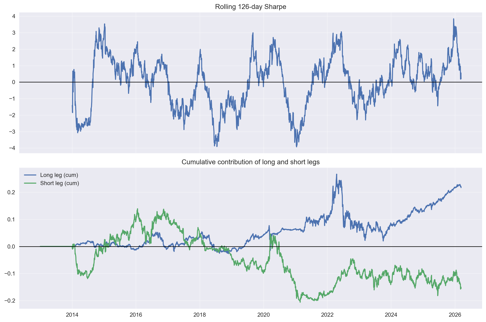

## Project Overview

This project implements and backtests a **global cross-asset long–short momentum strategy** using US-listed, USD‑denominated ETFs across commodities, government bonds, and currency trusts. The pipeline covers data cleaning, signal construction, portfolio formation, backtesting, and diagnostic notebooks for weights and PnL analysis.

## Data Sources

- **ETF prices** (`data/etf_data.csv` → `data/etf_data_clean.csv`):
  - Daily OHLC, Adj Close, and Volume for a diversified ETF universe.
  - Cleaned in `src/prepare_data.py` / `notebooks/data_coverage_analysis.ipynb`:
    - Multi-index CSV (price type × ticker) → single-level Close price panel.
    - Forward-fill for isolated missing observations.
    - Leading missing data left as NaN where ETFs start trading later.
- **Calendar**:
  - Implicit NYSE business-day calendar from ETF trading days.
  - All series aligned to a common daily index.

## Strategy Definition

- **Universe**: Liquid US-listed ETFs spanning:
  - Developed/emerging gov’t bonds, credit, commodities, and FX.
- **Rebalancing**:
  - First trading day of each month.
- **Signals** (computed in `src/backtest.py`):
  - Daily log returns from cleaned Close prices.
  - Lookback: $L = 252$ trading days (12 months), skip last 21 days (1 month).
  - **Raw momentum**: 11‑month sum of log returns over $[T-L, T-\text{skip}]$.
  - **11‑month volatility**: standard deviation of log returns in same window, annualized.
  - **Risk‑adjusted momentum score**:
    $$
    \text{mom\_score}(i, T) = \frac{\text{raw\_mom}(i, T)}{\text{vol\_11m}(i, T)}
    $$
- **Ranking and buckets**:
  - Cross‑sectional rank of `mom_score` at each rebalance.
  - **Long bucket**: top 30% by rank.
  - **Short bucket**: bottom 30% by rank.
  - Middle 40%: no position.
- **Position sizing**:
  - 21‑day (1‑month) rolling annualized volatility `vol_1m` for risk-parity sizing.
  - Longs: weights ∝ $1 / \text{vol\_1m}$, normalized to sum to +1.0.
  - Shorts: weights ∝ $1 / \text{vol\_1m}$, normalized to sum to −1.0.
  - Net exposure approximately 0, gross exposure ≈ 2.
- **Transaction costs**:
  - Per‑rebalance turnover estimated from absolute weight changes.
  - Basis‑point drag applied to obtain net returns.

## Implementation and Backtest

- **Core script**: `src/backtest.py`
  - Loads `data/etf_data_clean.csv`, builds log and simple returns.
  - Constructs `raw_mom`, `vol_11m`, `mom_score`, and `vol_1m`.
  - Determines monthly rebalance dates (first trading day per month).
  - Builds **target weights** on rebalance dates and **daily weights** via forward fill and 1‑day shift.
  - Computes daily portfolio PnL:
    - Gross return: weights × simple returns.
    - Transaction‑cost drag from turnover.
    - Net return series and cumulative equity curve.
  - Separately tracks long‑leg and short‑leg returns.
- **Artifacts written to disk**:
  - Weights:
    - `data/daily_weights.csv`: daily portfolio weights.
    - `data/target_weights_monthly.csv`: weights on rebalance dates.
    - `data/rebalance_diagnostics.csv`: per‑ticker, per‑rebalance diagnostics:
      - `raw_mom`, `vol_11m`, `mom_score`, `rank_pct`, `vol_1m`, `weight`.
  - PnL:
    - `data/strategy_daily_pnl.csv`: `port_rets_net`, `port_rets_gross`, `tc_drag`.
    - `data/strategy_equity_curve.csv`: `equity_curve`.
    - `data/strategy_legs_pnl.csv`: `long_rets`, `short_rets`.

## Results and Diagnostic Analysis

Analysis is primarily done in two notebooks:

- **Weights and decision logic** (`notebooks/weights_analysis.ipynb`):
  - Sanity checks on exposures:
    - Gross, net, long, and short exposure time series from `daily_weights.csv`.
  - Cross‑sectional behavior at rebalance:
    - Per‑asset weight heatmap over recent rebalance dates.
    - For each rebalance date, distribution of:
      - `raw_mom`, `vol_11m`, `mom_score`, `rank_pct`, and final `weight`.
    - Scatter of `mom_score` vs `weight` to confirm mapping from score to allocation.
  - Long vs short basket characteristics:
    - Average raw and risk‑adjusted momentum for long vs short buckets over time.
    - Total long and short book weights per month.

- **PnL and performance** (`notebooks/pnl_analysis.ipynb`):
  - Equity curve and drawdowns from `strategy_equity_curve.csv`.
  - Daily and monthly performance metrics:
    - Cumulative and annualized return, annualized volatility, Sharpe.
    - Max drawdown and Calmar.
    - Monthly return series, distribution, and hit rate.
  - Risk dynamics and contributions:
    - Rolling Sharpe (e.g., 6‑month window).
    - Cumulative PnL of long leg vs short leg from `strategy_legs_pnl.csv`.

Taken together, these diagnostics let you verify:

- The strategy systematically overweights higher **risk‑adjusted momentum** names and underweights the weakest ones.
- Long and short baskets behave sensibly (longs generally showing higher past momentum than shorts).
- The PnL profile (equity curve, drawdowns, and rolling Sharpe) is consistent with a diversified, leveraged long–short cross‑asset momentum strategy.

## Conclusion

The project delivers a reproducible backtest of a global ETF long–short momentum strategy with:

- A clear, documented signal definition (skip‑month, risk‑adjusted momentum).
- Transparent portfolio construction (bucketed by rank with inverse‑vol weighting).
- Persisted intermediates (weights, diagnostics, PnL) to allow detailed inspection of decisions and risk.

The analysis notebooks confirm that:

- Signal, ranks, and weights are internally consistent.
- The strategy’s PnL, drawdowns, and hit rates can be examined at multiple horizons (daily/monthly/rolling).

Whether the strategy is ultimately investable depends on your tolerance for leverage, drawdowns, and implementation costs, but the framework here is suitable for robust further research and parameter experimentation.

## Recommendations for Further Work

- **Robustness checks**:
  - Vary lookback, skip window, and long/short bucket widths (e.g. 20/20, 40/40).
  - Test alternative risk measures (e.g. downside volatility, EWMA vol).
- **Universe and constraints**:
  - Add explicit liquidity filters and maximum per‑ETF and per‑asset‑class weight caps.
  - Explore universe segmentation (e.g. separate bond, commodity, and FX portfolios).
- **Execution realism**:
  - Refine transaction‑cost model (spreads, fees, market impact).
  - Add delays, slippage, and borrow costs for shorts.
- **Benchmarks and overlays**:
  - Compare against simple benchmarks (e.g. equal‑weight long‑only portfolio).
  - Explore volatility targeting or drawdown controls.

## Key Charts (from notebooks)

- **Strategy equity curve and drawdowns** (from `pnl_analysis.ipynb`):
  
- **Monthly return distribution** (from `pnl_analysis.ipynb`):
  
- **Asset weights at rebalance dates** (from `weights_analysis.ipynb`):
  
- **Exposure time series** (from `weights_analysis.ipynb`):
  
- **Rolling Sharpe and long/short contribution** (from `pnl_analysis.ipynb`):
  

These charts collectively show how the strategy allocates capital, how those decisions evolve over time, and how they translate into realized PnL.